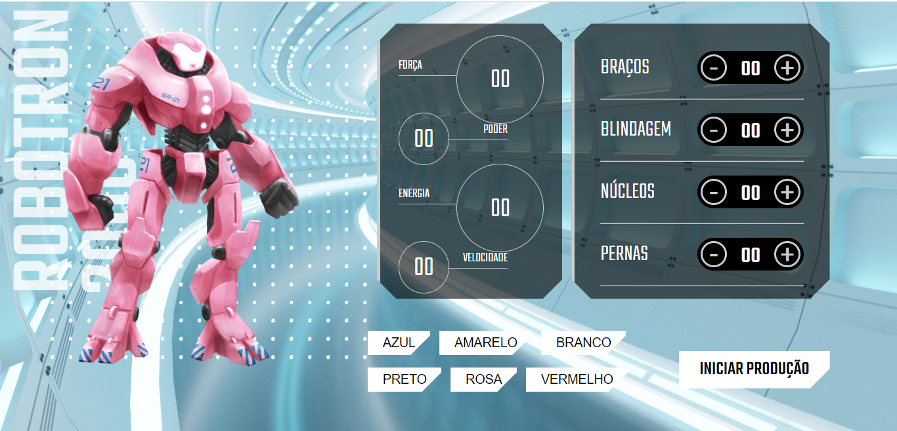

# Projeto Robotron 2000

Construa robôs para salvar o planeta Terra de uma invasão alienígena. 

Projeto Robotron 2000 desenvolvido no curso de Javascript - manipulando o DOM  da Alura.  
<strong>Objetivos:</strong> tomar a página dinâmica, manipular dados, eventos e elementos com JavaScript.

## 💻 Layout  

### Web

  

 ## 🔧 Tecnologias 

As tecnologias usadas foram: 
* HTML
* CSS
* JavaScript
